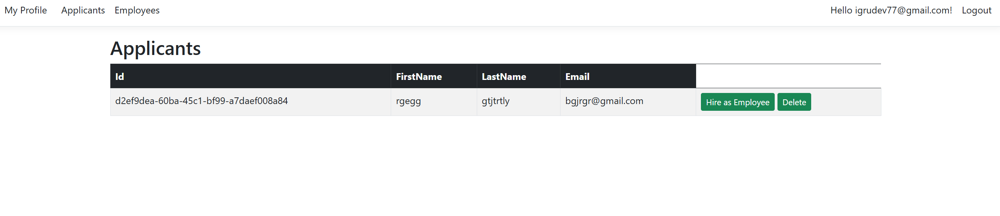
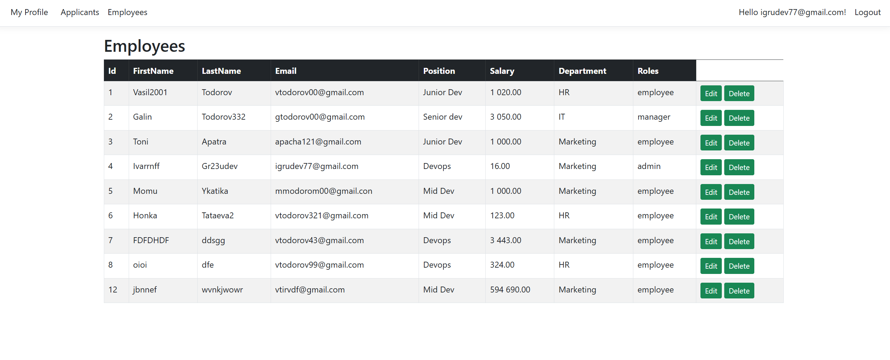
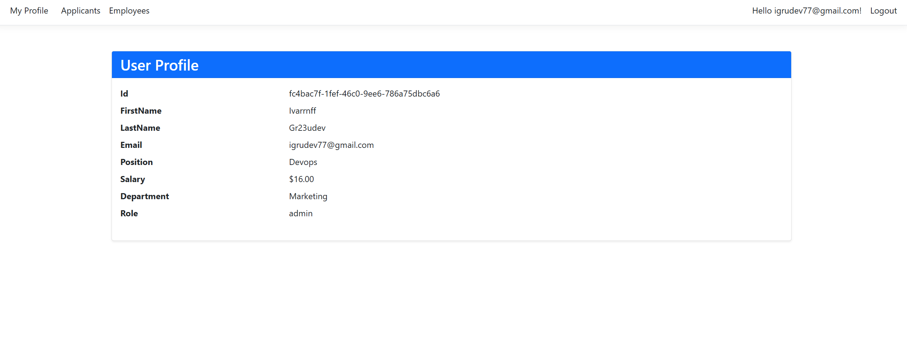

# 🧑‍💼 HR Management System – ASP.NET

A web-based Human Resources Management System built with **ASP.NET**. This project allows organizations to manage employee data, roles, and applicants.

## 📌 Features

- Employee registration and management
- Role-based authentication (Admin, HR, Employee)
- Department and salary management
- Secure login/logout system
- designed with Bootstrap
- Database integration with Microsoft SQL Server

## 🚀 Technologies Used

- ASP.NET MVC and Razor Pages(for Login and Registration)
- C#
- Microsoft SQL Server
- Entity Framework 
- HTML, CSS, JavaScript(jquery.js, bootstrap.js)
- Bootstrap 

## 📷 Screenshots
### Applicants

### Employees

### Profile



## 🛠️ Getting Started

### Prerequisites

- Visual Studio (2022 or newer)
- SQL Server
- .NET 8 SDK
- `dotnet tool install --global dotnet-ef`

### Setup Instructions

1. Initialize database:
```bash
dotnet ef database update
```

2. Set up environment value
```bash
$env:WORKING_DAYS_API_KEY = "YOUR_API_KEY"
```

3. Run the program on port 5182
```bash
dotnet run
```

4. Run Tests
```bash
dotnet test
```

3. Test user. You can use igrudev77@gmail.com, Test123!

## ➕ TODO
1. Validate user mail
2. Add departments management
3. Improve frontend with js and css
